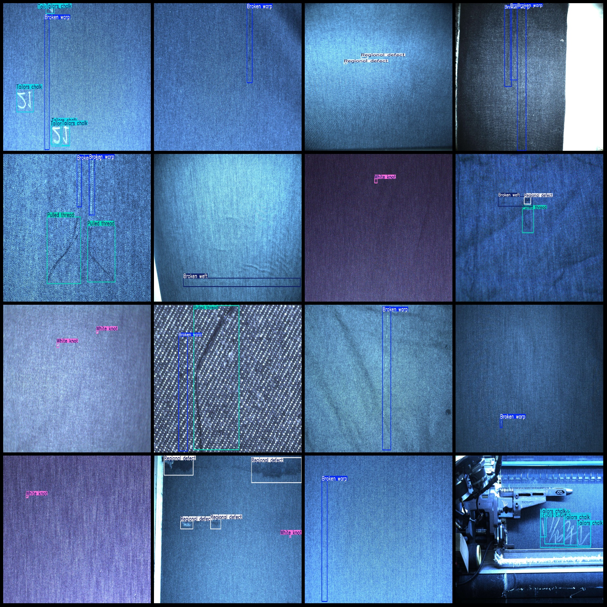

# Breathing-CO2 Detection Dataset with VOC+YOLO Format and 1858 Images in 8 Classes

```
# Fabric Defect Detection Dataset VOC+YOLO format 1858 images with 8 categories


1. Pascal VOC format
2. YOLO format

Number of images (number of jpg files): 1858
annotation count: 1858  
Label number: 8
Repository: firc-dataset
```json
{
  "categories": [
    "Aluminum bar",
    "Broken warp",
    "Broken weft",
    "Pulled thread",
    "Regional defect",
    "Tailors chalk",
    "White knot",
    "quxian"
  ]
}
```
boxes per class:   
The number of broken weft (broken warp) frames is 946.
Tailor's chalk is a type of powder that is used in the crafting of clothing. The term "frame" refers to the number of times a piece of clothing is cut or shaped by hand. So, if Tailor's chalk has 489 frames, it means that it takes 489 cuts or shapes to make one piece of clothing.
total boxes: 3733  
Use the labeling tool: labelImg
Rules for annotation: To draw a box around the category.
Important Note: None
Special Disclaimer: This dataset does not guarantee the accuracy of the trained model or the weight files.
```
## Images




Here is a pay link on Stripe ( https://buy.stripe.com/3cs8yP7sY87d0vu9AB ). Please contact me lonlonago@foxmail.com after funding $89, and I will send you a complete data files , thank you!


